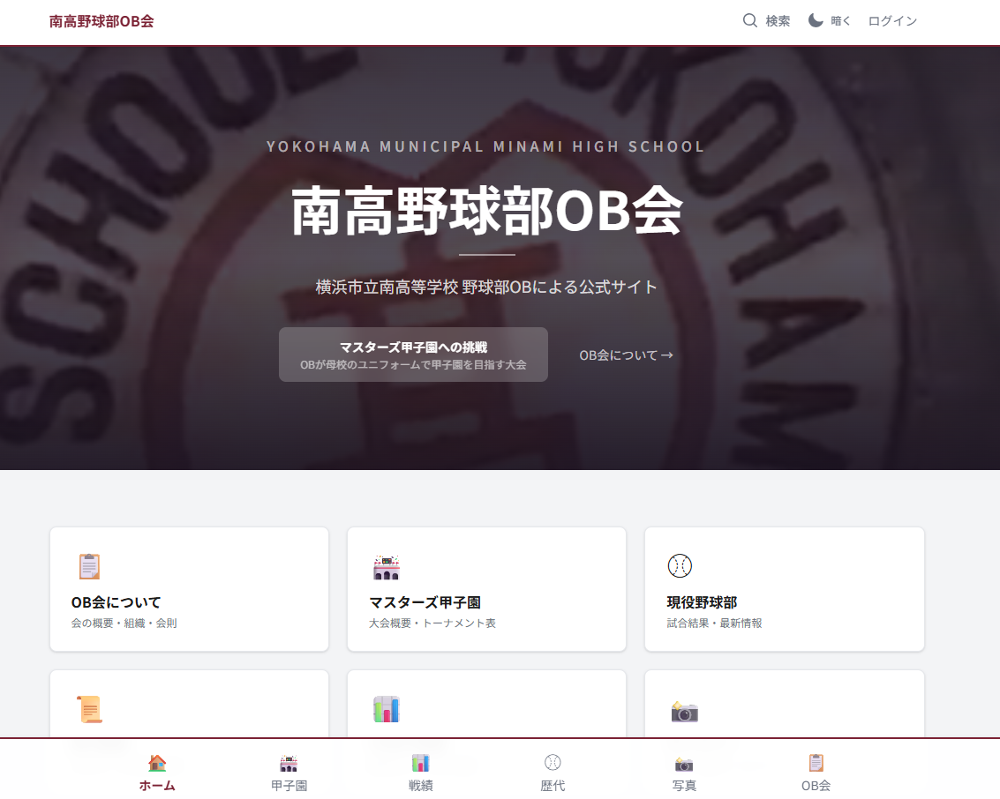
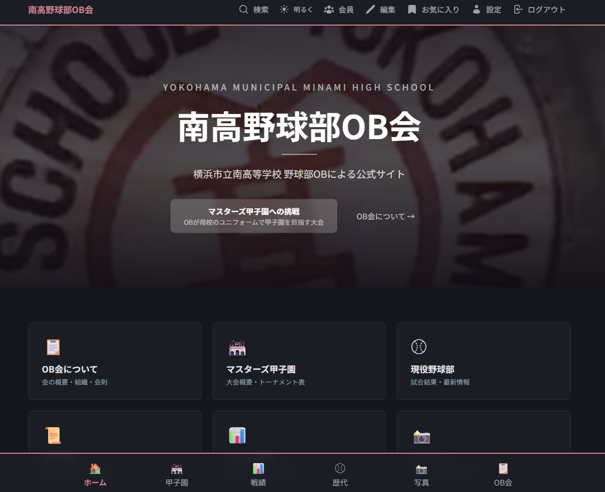
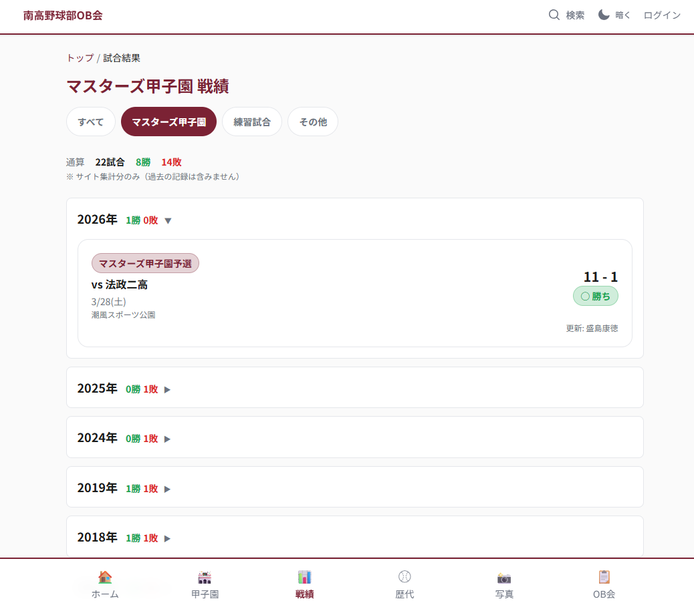
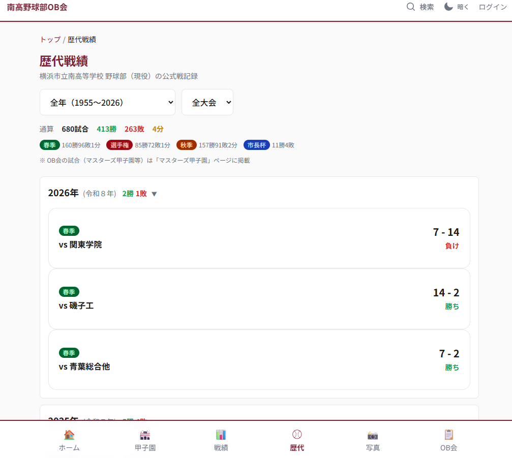
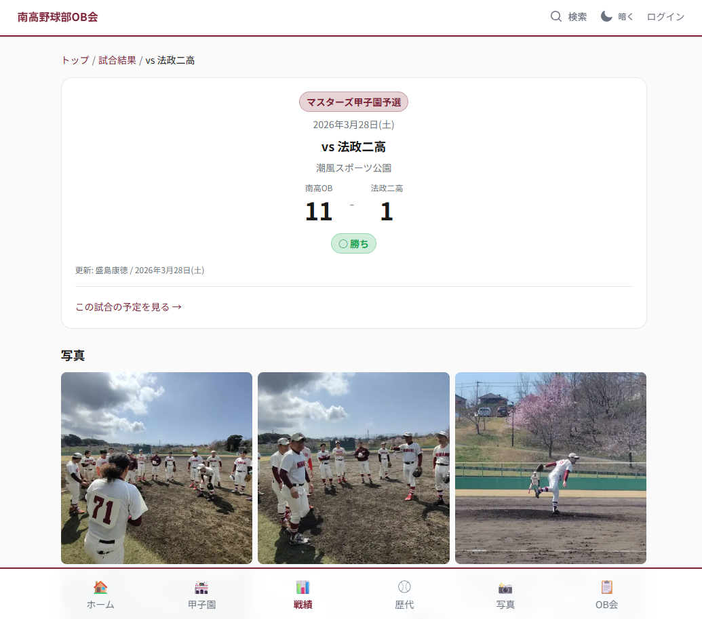
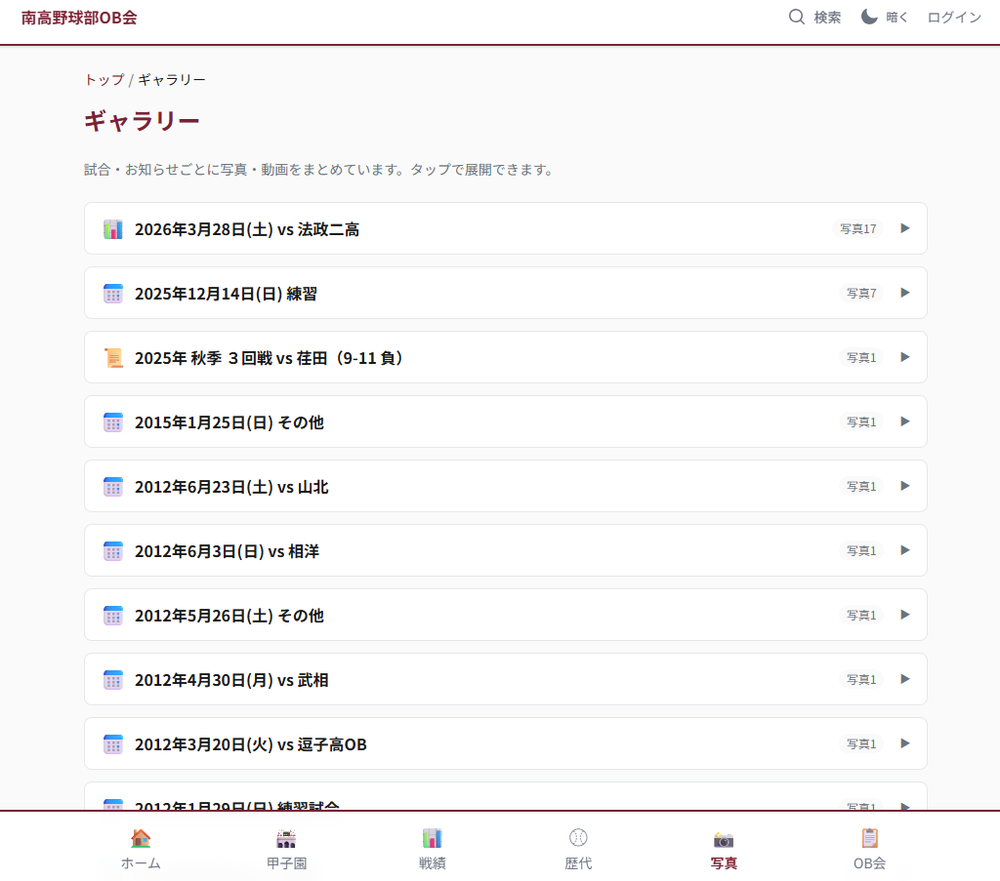
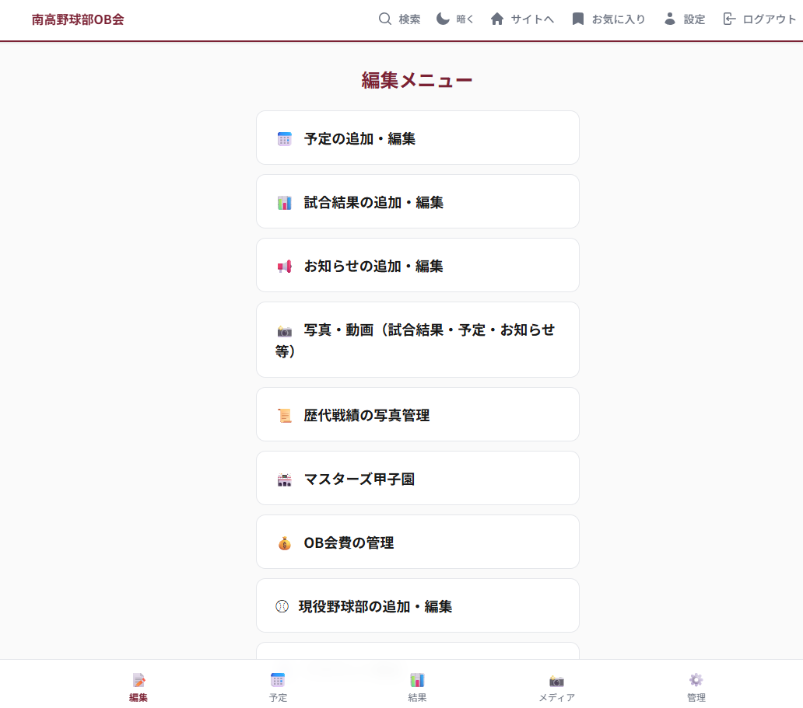
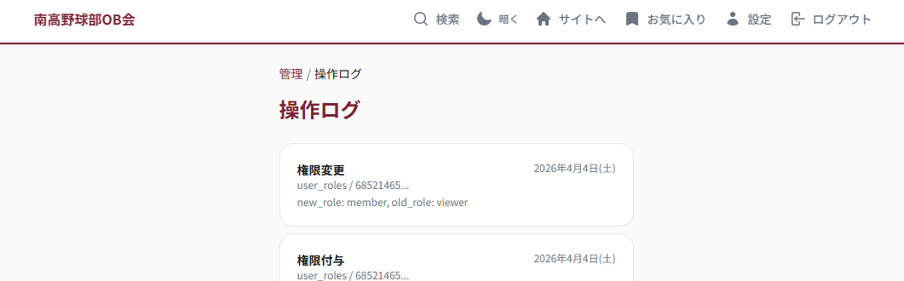
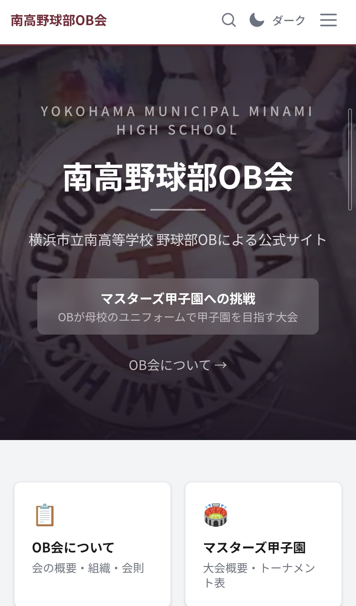

# Minami Baseball OB - 横浜市立南高校 野球部OB会 公式サイト


マスターズ甲子園への挑戦を続ける横浜市立南高校 野球部OB会の公式Webアプリケーション。試合結果・予定管理、1955年からの歴代戦績680試合のデータベース、会員管理、写真ギャラリーなどを、5段階の権限制御のもとで運用しています。

**https://minami-baseball-ob.vercel.app/** | ソースコード: private

---

### PC (Light / Dark)

<p>
  
  
</p>

### Features

<p>
  
  
</p>
<p>
  
  
</p>

### Admin / Editor

<p>
  
  
</p>

### Mobile

<p>
  
</p>

---

## Tech Stack

| Layer | Technology |
|-------|-----------|
| Framework | **Next.js 15** (App Router / React 19 / Server Components) |
| Language | **TypeScript 5.8** (strict mode) |
| Styling | **Tailwind CSS 4** (PostCSS-first, `@theme` CSS variables) |
| Database | **Supabase** (PostgreSQL + RLS + DB Triggers) |
| Auth | **Supabase Auth** (Google OAuth / SSR cookie pattern) |
| Storage | **Supabase Storage** (photos + videos + member docs + golf score PDFs, client-side resize) |
| Hosting | **Vercel** (git push auto-deploy) |
| CI/CD | **GitHub Actions** (4 workflows) |
| Analytics | **Google Analytics 4** (Cookie consent gate) |
| External | **Google Apps Script** (Form -> GitHub API bridge) |

---

## Architecture

```
                         +-----------------+
                         |   Google Forms  |
                         | (Member/Issue)  |
                         +--------+--------+
                                  |
                         Google Apps Script
                                  |
                    repository_dispatch / Issues API
                                  |
     +----------------------------v----------------------------+
     |                     GitHub Actions                      |
     |  member-request.yml  sync-roles.yml  purge  keep-alive |
     +---+---------------------+-------------------------------+
         |                     |
         | PR auto-create      | Role sync
         |                     |
     +---v---------------------v---+     +-------------------+
     |         GitHub Repo         |     |   Vercel (CDN)    |
     |  config/members.yml (RBAC)  +---->+   Auto Deploy     |
     |  data/senseki.json (680g)   |push |   Fluid Compute   |
     +-----------------------------+     +--------+----------+
                                                  |
                                         +--------v----------+
                                         |  Next.js 15 App   |
                                         |  38 pages + 9 API |
                                         |  30 components    |
                                         +--------+----------+
                                                  |
                               +------------------+------------------+
                               |                  |                  |
                      +--------v---+    +---------v----+   +---------v---+
                      | Supabase   |    | Supabase     |   | Supabase      |
                      | PostgreSQL |    | Auth (OAuth)  |   | Storage       |
                      | 21 tables  |    | Google SSO   |   | photos/       |
                      | RLS + Trig |    | 5-tier RBAC  |   | members-docs/ |
                      +------------+    +--------------+   | documents/    |
                                                           +---------------+
```

---

## Project Scale

| Metric | Count |
|--------|-------|
| TypeScript/TSX files | 98 |
| Lines of code | ~10,600 |
| Page routes | 38 |
| API routes | 9 |
| Reusable components | 30 |
| DB tables (+ history) | 21 + 6 |
| DB migrations | 26 |
| GitHub Actions workflows | 4 |
| Historical game records | 680 (1955-2026) |

---

## Key Features

### 5-Tier Role-Based Access Control

Middleware + RLS の2層で認可を実施。全操作を権限に応じて制御。

| Level | Role | Access |
|-------|------|--------|
| 1 | Guest | Public pages |
| 2 | `viewer` | Logged in, awaiting approval |
| 3 | `member` | + Member-only pages (総会・支援・会計・役員資料・ゴルフコンペ) |
| 4 | `editor` | + Content CRUD (10 edit pages) |
| 5 | `admin` | + User management, audit logs, trash |

- **Next.js Middleware**: Route-level access control, redirect unauthorized users
- **Supabase RLS**: Row-level policies using `get_user_role()` DB function
- **Component-level**: `useAuth()` hook for conditional UI rendering

### Automated Member Management Pipeline

Google Forms から PR 作成、マージで権限反映まで、**個人情報をGitに一切残さず**に完結する会員管理フロー。

```
Google Form submit
  -> Google Apps Script (repository_dispatch)
    -> GitHub Actions: auto-create PR (UUID + graduation year only)
    -> Supabase API: store display_name directly (bypass Git)
      -> Admin merges PR
        -> GitHub Actions: sync config/members.yml -> Supabase user_roles
```

- Personal names are stored **only in Supabase** (never in Git history)
- PR titles show graduation year only: `会員申請: 28期 -> member`
- Admin privilege escalation is rejected at workflow level
- Duplicate requests are auto-skipped

### Automated Bug Report Pipeline

OBメンバーがGitHub不要でフィードバックを送信できる仕組み。

```
Google Form (category + description + images)
  -> Google Apps Script
    -> Upload images to issue-images repo (Contents API)
    -> Create GitHub Issue with labels + Markdown image embeds
      -> Gmail notification to admin
```

### Historical Game Database (1955-2026)

`data/senseki.json` に680試合分の戦績データを格納。FC2旧サイトからのパース、外部ソースとの突合検証を経て構築。

- 680 games with stable IDs (validated by `scripts/validate-senseki-ids.js`)
- Cross-referenced with multiple external sources
- Dynamic sitemap generation for all 680 game detail pages
- Photo linkage per game (uploaded via admin UI)

### Content Management (Custom CMS)

外部CMSを使わず、**Supabase + Next.js で構築した独自CMS**。ソフトデリート、変更履歴、監査ログを標準装備。

- **10 editor pages**: Results, Schedule, Announcements, Media, Masters, History, Dues, Current Team, Members Posts, Golf
- **Inline editing**: Edit content directly on detail pages (no page transition)
- **Inline photo upload**: Upload photos from any detail page
- **Soft delete + 7-day trash**: Auto-purge via scheduled GitHub Actions
- **Change history**: DB triggers auto-save previous versions on UPDATE/DELETE
- **Audit logs**: All privilege changes and deletions are recorded
- **Bidirectional linking**: Schedule <-> Results linked by `schedule_id`, photos shared across both

### Photo & Media Management

- Client-side resize (max 1200px, JPEG 85%) before upload to Supabase Storage
- Multi-select batch delete
- Lightbox viewer with keyboard navigation
- Folder view grouped by linked content (results/schedule/history/announcements)
- Storage usage visualization with progress bar (1GB quota)
- FC2 archive photos migrated (2010-2012 event thumbnails)

### Members-Only Content Management

会員専用ページに5カテゴリの資料管理。PDF添付・年度別グルーピング・役員テーブル編集・ゴルフコンペ歴代結果を統合。

- **5 categories**: OB会総会 / 野球部支援 / 会計関係 / OB会役員 / ゴルフコンペ
- **File attachments**: Upload to private `members-docs` bucket, download via signed URLs
- **Fiscal year grouping**: Auto-group by Japanese fiscal year (April start) with wareki labels
- **Officer table**: OB会役員 category renders as editable role/name/class table
- **Inline CRUD**: Editors can create/edit/delete posts directly on the members-only page

### Search & Discovery

- **Global search**: Cross-table full-text search (results, schedule, announcements, history)
- **Result filtering**: Masters Koshien / Practice / Golf / Other tab switching (Golf tab links to members-only page)
- **Bookmarks**: Logged-in users can save articles (RLS: own data only)
- **Gallery auto-scroll**: `?open=folder` query parameter for deep linking

---

## Database Design

21 tables + 6 history tables + 5 views, all protected by Row-Level Security.

```
user_roles ----< results         (author)
    |      ----< schedule        (author)
    |      ----< announcements   (author)
    |      ----< current_team_posts (author)
    |      ----< members_posts   (author, member+ read, editor+ write)
    |      ----< bookmarks       (owner, RLS: self-only)
    |      ----< dues_payments   (target member)
    |
    +-- audit_logs               (auto-recorded by DB triggers)
    +-- golf_competitions        (golf competition results, 30 records)
    +-- *_history (x6)           (auto-saved on UPDATE/DELETE, incl. golf_competitions_history)

photos ----< results | schedule | announcements | history
videos ----< results | schedule | announcements

schedule <---> results           (bidirectional via schedule_id)
masters_documents                (tournament PDFs, stored in GitHub)

Storage buckets:
  photos/        (public, gallery + inline uploads)
  members-docs/  (private, member+ read, signed URL download)
  documents/     (private, golf score PDFs, signed URL download)
```

### Tables

| Table | Description |
|-------|-------------|
| `user_roles` | Permissions (admin/editor/member/viewer) + display name + graduation class |
| `results` | Game results (Masters Koshien / practice / other). Soft delete |
| `schedule` | Events (games, practice, social). Soft delete |
| `announcements` | News posts. Soft delete |
| `current_team_posts` | Current team news. Soft delete |
| `members_posts` | Members-only posts (4 categories, file attachments via JSONB, fiscal year grouping). Soft delete |
| `photos` | Photo metadata (Storage integration, FK linkage, soft delete, history linkage) |
| `videos` | Videos (YouTube embed URL) |
| `members` | Member info (admin-only read via RLS) |
| `masters_documents` | Tournament document metadata |
| `dues_payments` | Membership dues (per fiscal year, with/without account) |
| `audit_logs` | Audit trail (privilege changes, soft deletes via DB trigger) |
| `bookmarks` | User bookmarks (RLS: self-only) |
| `golf_competitions` | Golf competition results (30 records, score PDFs via documents/ bucket). Soft delete |
| `*_history` (x6) | Change history (auto-saved on UPDATE/DELETE via DB trigger, incl. golf_competitions_history) |

### DB Functions & Triggers

| Function | Type | Purpose |
|----------|------|---------|
| `get_user_role()` | RLS | Get current user's role |
| `is_admin()` | RLS | Check if admin |
| `is_editor_or_above()` | RLS | Check if editor+ |
| `is_member_or_above()` | RLS | Check if member+ |
| `set_updated_at()` | Trigger | Auto-update `updated_at` |
| `log_user_roles_change()` | Trigger | Record role changes to `audit_logs` |
| `log_soft_delete()` | Trigger | Record soft deletes to `audit_logs` |

### Key Design Decisions

- **Soft delete** on all content tables (`deleted_at` column) with 7-day auto-purge
- **DB triggers** for `updated_at`, audit logging, and history snapshots
- **Views** (`*_with_author`) join author display names with `deleted_at IS NULL` filter
- **26 versioned migrations** in `supabase/migrations/`

---

## CI/CD & Automation

| Workflow | Trigger | What it does |
|----------|---------|-------------|
| **Member Request PR** | Google Form (via GAS `repository_dispatch`) | Auto-creates PR with role config, stores name in Supabase directly |
| **Sync Member Roles** | Push to `config/members.yml` | Parses YAML, updates Supabase `user_roles`, demotes unlisted users |
| **Purge Deleted Records** | Daily (UTC 19:00) | Removes soft-deleted records + Storage objects older than 7 days |
| **Keep Supabase Alive** | Weekly (Sunday UTC 0:00) | Pings Supabase REST API to prevent free-tier hibernation |

All workflows use **minimal `permissions`** (principle of least privilege).

### Google Apps Script Integrations

| Script | Purpose |
|--------|---------|
| `gas-member-form/` | Member signup form -> `repository_dispatch` -> PR auto-creation |
| `gas-issue-form/` | Feedback/bug report form -> GitHub Issue with labels + image upload |

---

## Security

| Measure | Implementation |
|---------|---------------|
| **Row-Level Security** | All tables. `members_posts`: member+ read. Private storage bucket with signed URLs |
| **Server-only admin client** | `import "server-only"` prevents client-side import of service_role key |
| **Auth callback validation** | Open redirect prevention in `/auth/callback` |
| **Workflow permissions** | Every GitHub Actions workflow declares minimal permissions |
| **CODEOWNERS** | `.github/workflows/`, `config/`, `supabase/` require admin review |
| **Branch protection** | Direct push to master blocked, PR + CODEOWNERS required |
| **Secret scanning** | Push protection enabled |
| **Dependabot** | Vulnerability auto-detection |
| **Privacy-first membership** | Personal names never appear in Git history (UUID + graduation year only) |
| **Cookie consent** | GA4 script loads only after explicit user consent |
| **Session management** | 60-min idle timeout with auto-logout (cross-tab sync, 5-min warning) |
| **Account deletion** | Users can fully delete their account (auth + user_roles) |
| **Data export** | Users can download their data as JSON |
| **Structured logging** | JSON logs in API routes for Vercel dashboard filtering |
| **Audit logs** | All privilege changes and deletions auto-recorded via DB triggers |

---

## UX & Accessibility

- Mobile-first responsive design (base font 18px, line-height 1.7)
- All touch targets >= 44px
- Dark mode with team color accent (maroon `#7b2234` / dark rose `#d08090`)
- `aria-label` on result badges (Win/Loss/Draw)
- PWA install prompt (iOS Safari guide + Android native)
- Page transition progress bar
- Error boundaries with custom pixel art mascot
- Breadcrumbs on all detail pages
- Scroll-to-top floating button

---

## Page Structure

```
Public (15 pages)
  /                        Top page (hero + photo grid + news + schedule + results)
  /about                   About the OB association
  /masters                 Masters Koshien info hub
  /results                 Game results (filter: masters/practice/other)
  /results/[id]            Game detail (photos, videos, inline edit)
  /schedule                Upcoming events
  /schedule/[id]           Event detail
  /announcements           News
  /announcements/[id]      News detail
  /current-team            Current high school team
  /current-team/[id]       Team post detail
  /gallery                 Photo/video gallery (folder view)
  /history                 Historical records 1955-2026 (680 games)
  /history/[id]            Historical game detail
  /search                  Cross-table full-text search

Auth (5 pages)
  /login                   Google OAuth login
  /account                 Profile, data export, cookie settings, account deletion
  /bookmarks               Saved articles
  /members-only            Members-only content (5 categories, inline CRUD, file attachments)
  /members-only/golf       Golf competition history (30 results + score PDFs)

Editor (10 pages)
  /edit/results            Game results CRUD
  /edit/schedule           Events CRUD
  /edit/announce           Announcements CRUD
  /edit/media              Photo/video management
  /edit/masters            Tournament brackets + documents
  /edit/history            Historical game photo management
  /edit/dues               Membership dues tracking
  /edit/current-team       Current team posts CRUD
  /edit/members-posts      Members-only posts CRUD
  /edit/golf               Golf competition results CRUD

Admin (4 pages)
  /admin                   Dashboard
  /admin/roles             User role management
  /admin/trash             Soft-deleted items (restore/permanent delete)
  /admin/audit             Audit log viewer
```

---

## Design

| Element | Value |
|---------|-------|
| Primary color | Maroon `#7b2234` (team color) |
| Dark mode accent | Dusty rose `#d08090` |
| Footer background | Dark maroon `#3d1520` |
| Mobile font | 18px / line-height 1.7 |
| Layout | Mobile-first, bottom navigation on mobile |
| CSS Architecture | Tailwind CSS 4 `@theme` with CSS variables for light/dark |
| Icons | Custom pixel art mascots (pitcher, batter, fielder) |
| Component library | Custom (no external UI framework) |

---

## FC2 Migration

旧公式サイト（FC2）から段階的に情報を移管。

- **Completed**: OB会概要・設立趣旨、活動内容、校歌・応援歌、関連リンク、OB会規約（全15条+付則）
- **Data migrated**: 歴代戦績 680試合 (1955-2026) -> `data/senseki.json` (41% verified)
- **Data migrated**: マスターズ甲子園過去戦績 20試合 (2011-2024) -> `results` table
- **Photos migrated**: FC2 event thumbnails 15枚 (2010-2012) -> Supabase Storage
- **Data migrated**: ゴルフコンペ結果 31回分 (第1回〜第31回、第19回欠番で30件) -> `golf_competitions` table
- **Files migrated**: スコア表PDF 25件 -> Supabase Storage (private `documents/` bucket)
- **Migrated to members-only**: 役員一覧 (12名) -> `members_posts` (OB会役員カテゴリ)
- **Remaining**: 会長挨拶（個人情報要判断）
