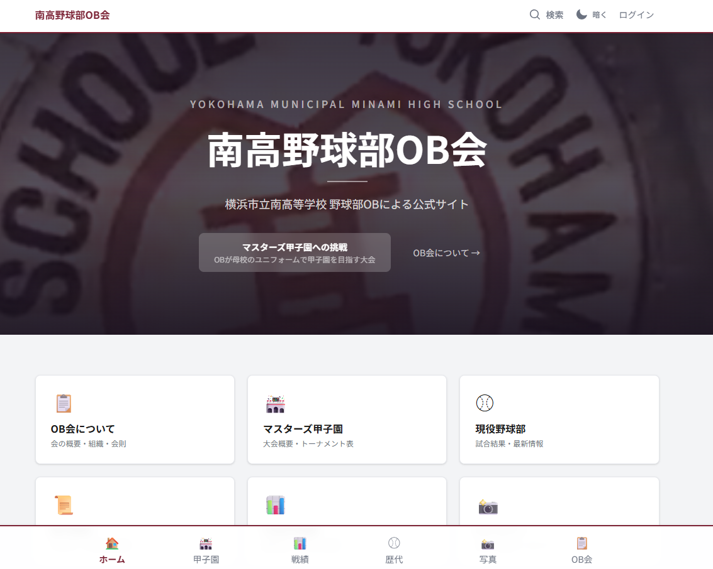
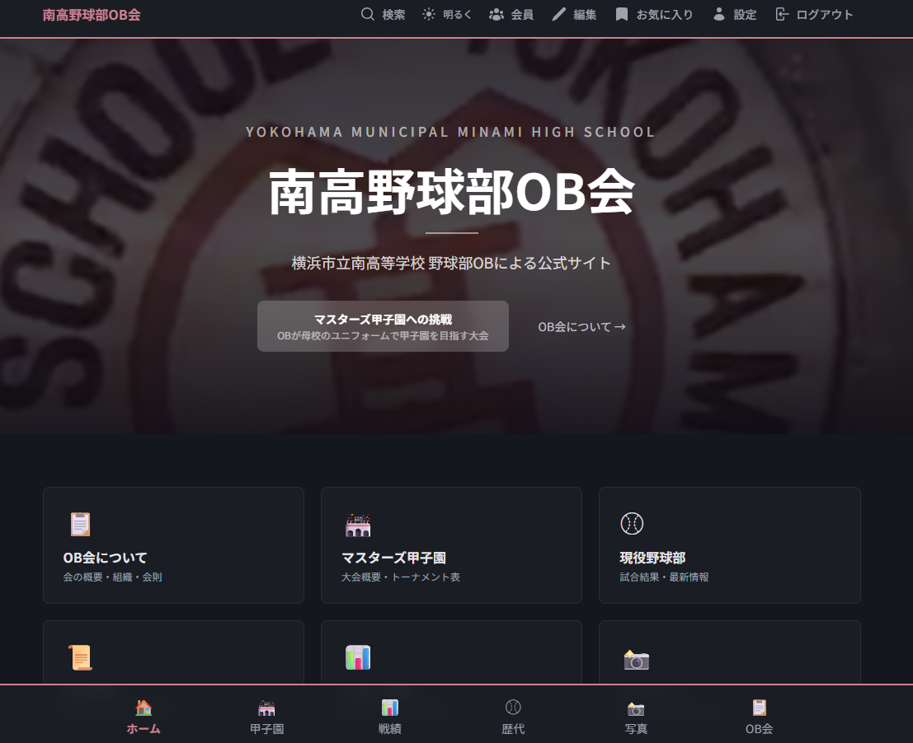
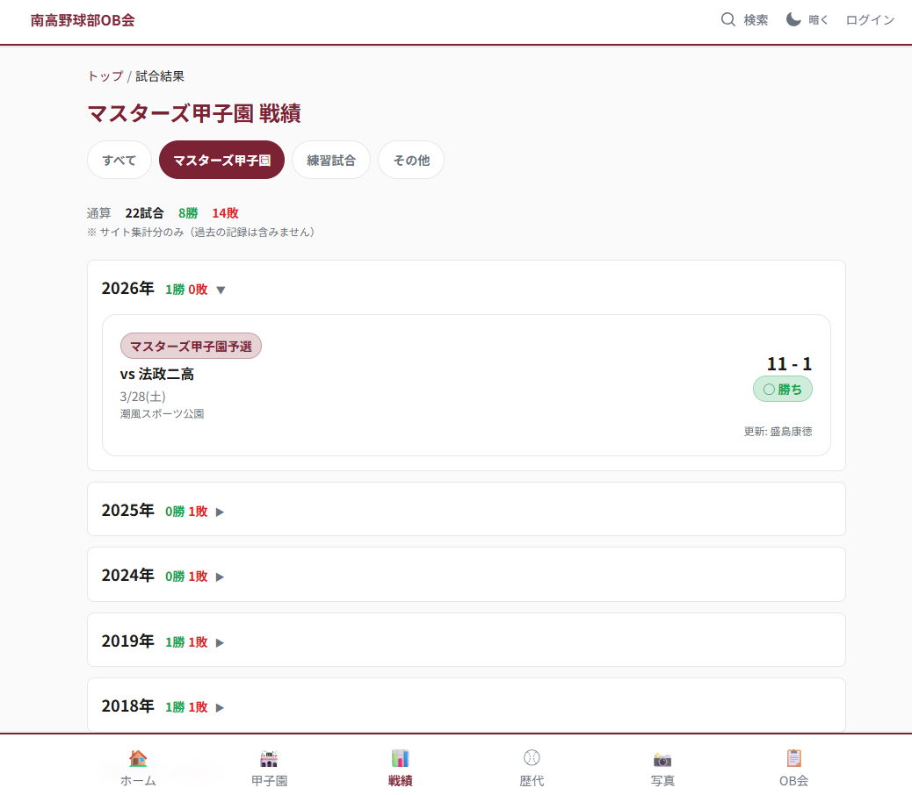
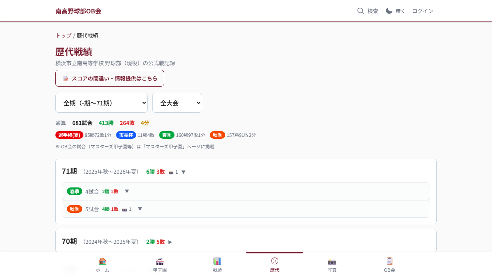
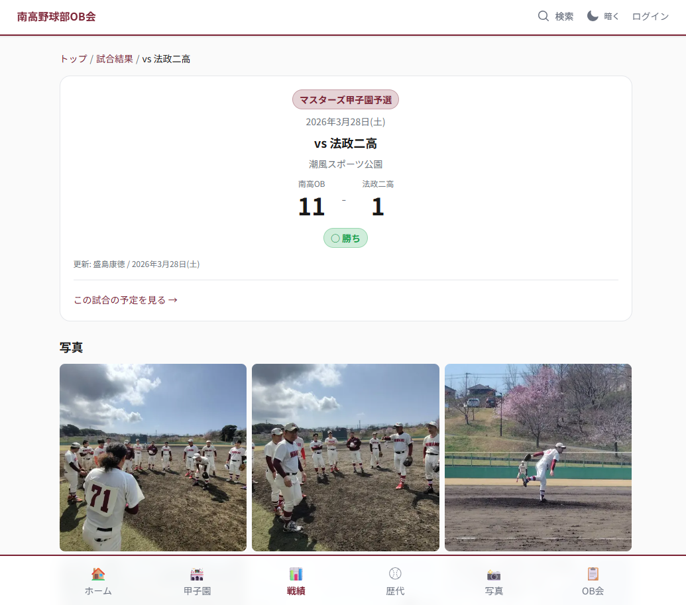
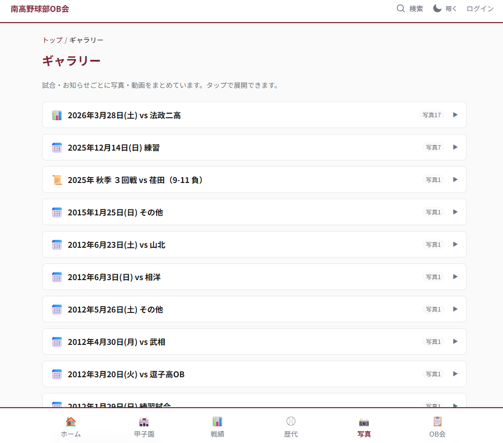
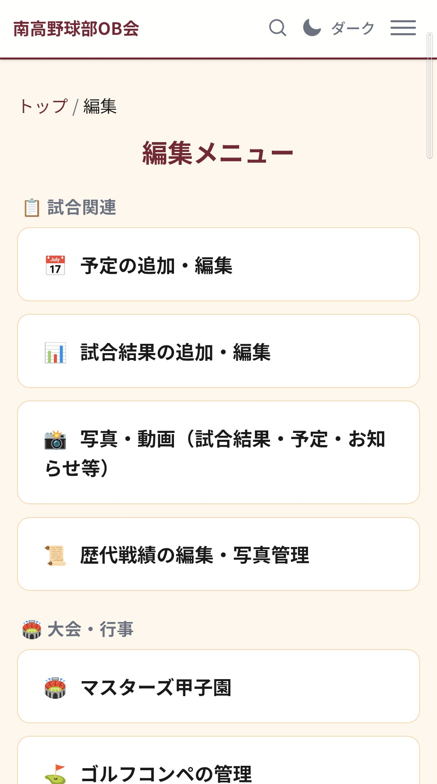
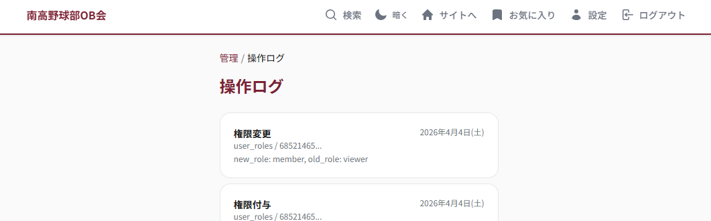
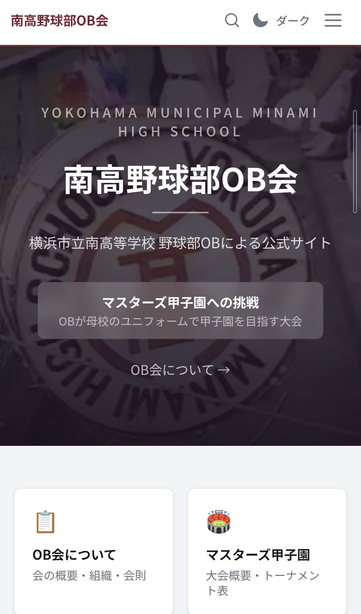

# Minami Baseball OB - 横浜市立南高校 野球部OB会 公式サイト


マスターズ甲子園への挑戦を続ける横浜市立南高校 野球部OB会の公式Webアプリケーション。試合結果・予定管理、1955年からの歴代戦績<!--stat:senseki-->0<!--/stat-->試合のデータベース、会員管理、写真ギャラリーなどを、5段階の権限制御のもとで運用しています。

**https://minami-baseball-ob.vercel.app/** | ソースコード: private | 公開 cron workflow: [minami-public-cron](https://github.com/yasumorishima/minami-public-cron)

---

### PC (Light / Dark)

<p>
  
  
</p>

### Features

<p>
  
  
</p>
<p>
  
  
</p>

### Admin / Editor

<p>
  
  
</p>

### Mobile

<p>
  
</p>

---

## Tech Stack

| Layer | Technology |
|-------|-----------|
| Framework | **Next.js 15** (App Router / React 19 / Server Components) |
| Language | **TypeScript 5.8** (strict mode) |
| Styling | **Tailwind CSS 4** (PostCSS-first, `@theme` CSS variables) |
| Database | **Supabase** (PostgreSQL + RLS + DB Triggers) |
| Auth | **Supabase Auth** (Google OAuth / SSR cookie pattern) |
| Storage | **Supabase Storage** (photos + videos + member docs + golf score PDFs, client-side resize) |
| Hosting | **Vercel** (git push auto-deploy) |
| CI/CD | **GitHub Actions** (private = 8 workflows on RPi5 self-hosted ARM64 + 公開 cron mirror [minami-public-cron](https://github.com/yasumorishima/minami-public-cron) で 3 workflow on ubuntu-latest; hosted 残置 = gcp-cost-monitor のみ) |
| Analytics | **Google Analytics 4** (Cookie consent gate) |
| Maps | **Google Maps Embed API** (venue maps with navigation links) |
| Weather | **Open-Meteo API** (free, no API key, 30-min ISR cache + 30-min external cron warm to keep all 10 venues fresh for the first morning visitor) |
| Testing | **Playwright** (e2e: skeleton/navigation/weather/screenshot) |
| GitHub integration | **GitHub App `minami-baseball-ob-bot`** (Installation token via `@octokit/auth-app`, PAT-less) |
| External | **Google Apps Script** (Member form dispatch + feedback Gmail notification) |

---

## Architecture

```
                         +-----------------+
                         |  Google Form    |
                         |  (Member)       |
                         +--------+--------+
                                  |
                         Google Apps Script
                                  | HMAC (WEBHOOK_SECRET)
                                  v
                         +-----------------+
                         |  Vercel API     |
                         |  /api/gas-proxy |  (GitHub App minami-baseball-ob-bot)
                         +--------+--------+
                                  | repository_dispatch
                                  v
     +----------------------------+----------------------------+
     |                     GitHub Actions                      |
     |  member-request  sync-roles  purge  check-team  stats  |
     +---+---------------------+-------------------------------+
         |                     |
         | PR auto-create      | Role sync
         |                     |
     +---v---------------------v---+     +-------------------+
     |         GitHub Repo         |     |   Vercel (CDN)    |
     |  config/members.yml (RBAC)  +---->+   Auto Deploy     |
     |                             |push |   Fluid Compute   |
     +-----------------------------+     +--------+----------+
                                                  |
                                         +--------v----------+
                                         |  Next.js 15 App   |
                                         |  38 pages + 9 API |
                                         |  41 components    |
                                         +--------+----------+
                                                  |
                               +------------------+------------------+
                               |                  |                  |
                      +--------v---+    +---------v----+   +---------v---+
                      | Supabase   |    | Supabase     |   | Supabase      |
                      | PostgreSQL |    | Auth (OAuth)  |   | Storage       |
                      | 22 tables  |    | Google SSO   |   | photos/       |
                      | RLS + Trig |    | 5-tier RBAC  |   | members-docs/ |
                      +------------+    +--------------+   | documents/    |
                                                           +---------------+
```

---

## Project Scale

<!-- stats-start (auto-updated by GitHub Actions) -->
| Metric | Count |
|--------|-------|
| TypeScript/TSX files | <!--stat:ts_files-->138<!--/stat--> |
| Lines of code | <!--stat:loc-->~16400<!--/stat--> |
| Page routes | <!--stat:pages-->38<!--/stat--> |
| API routes | <!--stat:apis-->13<!--/stat--> |
| Reusable components | <!--stat:components-->47<!--/stat--> |
| DB tables (+ history) | <!--stat:tables_main-->16<!--/stat--> + <!--stat:tables_hist-->6<!--/stat--> |
| DB migrations | <!--stat:migrations-->43<!--/stat--> |
| GitHub Actions workflows | <!--stat:workflows-->8<!--/stat--> |
| Historical game records | <!--stat:senseki-->0<!--/stat--> (1955-2026) |
<!-- stats-end -->

---

## Key Features

### 5-Tier Role-Based Access Control

Middleware + RLS の2層で認可を実施。全操作を権限に応じて制御。

| Level | Role | Access |
|-------|------|--------|
| 1 | Guest | Public pages |
| 2 | `viewer` | Logged in, awaiting approval |
| 3 | `member` | + Member-only pages (総会・支援・会計・役員資料・ゴルフコンペ) |
| 4 | `editor` | + Content CRUD (9 edit pages + inline editing) |
| 5 | `admin` | + User management, audit logs, trash |

- **Next.js Middleware**: Route-level access control, redirect unauthorized users
- **Supabase RLS**: Row-level policies using `get_user_role()` DB function
- **Component-level**: `useAuth()` hook for conditional UI rendering

### Automated Member Management Pipeline

Google Forms から PR 作成、マージで権限反映まで、**個人情報をGitに一切残さず**に完結する会員管理フロー。

```
Google Form submit
  -> Google Apps Script (HMAC-signed call to Vercel proxy)
    -> Vercel /api/gas-proxy/dispatch (GitHub App minami-baseball-ob-bot via Installation token)
      -> GitHub repository_dispatch
        -> GitHub Actions: auto-create PR (UUID + graduation year only)
        -> Supabase API: store display_name directly (bypass Git)
          -> Admin merges PR
            -> GitHub Actions: sync config/members.yml -> Supabase user_roles
```

- Personal names are stored **only in Supabase** (never in Git history)
- PR titles show graduation year only: `会員申請: 28期 -> member`
- Admin privilege escalation is rejected at workflow level
- Duplicate requests are auto-skipped

### In-App Feedback Form

OBメンバーがGitHub不要でフィードバックを送信できる仕組み。サイト内 `/feedback` ページで完結。

```
/feedback page (category + description + image upload)
  -> Next.js API route
    -> Create GitHub Issue with labels + image attachments
    -> GAS Web App -> Gmail notification to admin
```

- Google login required (Supabase Auth)
- Camera/gallery image upload with client-side compression (up to 3 images)
- Honeypot + IP rate limiting (5 requests/hour) for spam protection

### Weather Forecast Integration

Open-Meteo API（無料）を使った球場別天気予報。予定との連動で試合当日の天気をすぐ確認できる。

- **10 venues** with lat/lon coordinates (`lib/venues.ts`)
- **Schedule integration**: Weather badge on schedule list, full weather section on schedule detail
- **`/weather` page**: All venues at a glance, expandable cards with 3-day forecast + hourly breakdown
- **Color-coded icons**: Weather group-specific colors (sun=amber, cloud=gray, rain=blue, snow=sky, thunder=yellow) with CSS variables for automatic light/dark mode switching
- **Precipitation icons follow mainstream weather app conventions**: hidden when probability < 20% (matches NHK / tenki.jp / iPhone Weather), ☔ at 20% and above, ❄️ for snow (WMO codes 71-77, 85-86), ⚡ for thunder (95-99)
- **Bi-directional weatherCode ↔ probability reconciliation**: Open-Meteo computes `weatherCode` and `precipitation_probability` independently and sometimes returns contradictions (e.g. `code=3 cloudy + prob=98%` or `code=51 drizzle + prob=3%`). `getEffectiveWeatherCode` reconciles both directions so the displayed weather icon and the umbrella indicator always agree — light rain codes at <20% are downgraded to cloudy, clear/cloudy at ≥20%/≥80% are upgraded to light rain/rain. Severe codes (heavy rain 65, violent showers 82, freezing rain 56-57/66-67, snow 71-77/85-86, thunder 95+) are always preserved and always show their warning icon regardless of probability, so rare but critical conditions are never hidden
- **Wind speed display** (m/s) on both daily and hourly views, color-coded by strength for baseball relevance: 穏やか (<5 m/s, subdued) / やや強 (5-9 m/s, normal) / 強風 (10+ m/s, red). Uses `wind_speed_unit=ms` on the Open-Meteo API (earlier code displayed km/h values labeled as m/s — fixed)
- **Humidity display**: Open-Meteo の `relative_humidity_2m` を取得し、メインカードで気温/湿度/降水を縦並び表示、時間別セルに `湿XX%`、3日カード（今日/明日/明後日）に max/min を表示。Open-Meteo の daily endpoint に湿度集計はないため、hourly から日毎の最大/最小を算出
- **WBGT (熱中症指数) warning**: 気温と湿度から `0.725*T + 0.0368*RH + 0.00364*T*RH - 4.25` で算出し、日本スポーツ協会の運動指針に沿って 注意(21+)/警戒(25+)/厳重警戒(28+)/危険(31+) を判定。「暑さ指数の目安」パネルで 4 段階の閾値 + 推奨行動（こまめに水分補給を/積極的に休憩・水分補給を/激しい運動は避けてください/運動は原則中止）を /weather と試合詳細天気欄の上部にまとめて 1 つだけ表示し、/weather では sticky-top でスクロール中も視認継続。個別バッジは「⚠ 熱中症 注意（本日 N時ピーク）暑さ指数 22」 形式で**判定は current 値ではなく当日 hourly の WBGT ピーク**を使い、 朝の時点で午後ピーク (例: 14:00 WBGT 21.7) が来る日も確実に警戒として可視化される (試合詳細ページの badge も試合日 hourly ピークで `/weather` と整合)。 時間帯セル / 時間帯推移ストリップにも `WBGT NN` を per-hour 表示 (tier 色付き、 閾値未満は text-dim)。 涼しい日（全球場 1 日中 WBGT < 21）は panel 自体を非表示。 屋外練習・試合の熱中症リスクを当日朝の時点で午後ピークまで含めて判断できる
- **Accurate Japanese WMO labels**: code 2 = 晴れ時々くもり (previously inverted as くもり時々晴れ), code 53 = 霧雨 (previously collided with code 63 rain), code 48 = 凍る霧 (previously mislabeled as 霧氷 which means rime ice on objects)
- **Composite daily label + transition icons**: 3時間刻み(6/9/12/15/18/21時)サンプルから AM(6,9) / PM(12,15,18,21) の多数派を取り、AM≠PM なら「Aのち B」(例: 雨のち晴れ)、AM=PM で降水系が2スロット以上なら「主時々雨」と合成。「のち」表示時は2アイコンを矢印で並べて遷移を視覚化（「雨のち晴れ」→ ☔ → ☀️）。降水/湿度/風速の日別集計も同じ3時間刻みサンプルから算出するので、ラベル・アイコン・数値が完全に整合する。優先度: 雷>雪>雨>曇>晴で同数時に重要側を採用、晴/曇のバリエーションは情報価値が低いため「時々」化しない
- **Enlarged mobile hourly icons** (16 → 40 px) so composite icons like 晴れ時々くもり are actually distinguishable
- **30-min ISR cache** via `next.revalidate` to avoid excessive API calls
- **Home weather ticker (TV 端風)**: ヒーロー直下に横浜スタジアム (OB 会 primary 球場) 専用の 1 行天気バーを常時表示。 dark bg (`bg-hero-bg`) + チームエンジ色 2px トップライン + 左流れマーキー (CSS @keyframes 35s linear infinite、 hover で停止、 `prefers-reduced-motion` で静的表示)、 タップで `/weather` 全球場ページへ遷移。 mobile では指で swipe して手動横スクロール (touchmove 8px 超で animation pause + native scroll、 inner computed transform から scrollLeft 転写で視覚スナップ防止、 touchend 4 秒 idle で animation 頭から再開)。 内容: 天気アイコン / 球場名 / 気温 / 降水% / 当日 WBGT 警戒 chip (出る日のみ、 文字は mobile 14px / sm+ 16px)。 Server Component で `fetchWeather` を `/weather` と Data Cache 共有 (URL 同一 → dedup) + 30 分 ISR、 touch handler のみ Client Component に分離
- **Home section rhythm**: `--color-section-white` theme token (`#ffffff` light / `#2a2520` dark) を追加、 「新着情報」 section に `bg-section-white` を適用してヒーロー → マーキー (dark) → 活動紹介 (cream-alt) → ... → 新着情報 (white) → 今後の予定 (cream-alt) の cream / yellow / white 3 段リズムを生む
- Smooth card expand/collapse animation with scroll position correction

### Historical Game Database (1955-2026)

Supabase `history_matches` テーブルに<!--stat:senseki-->0<!--/stat-->試合分の戦績データを格納。FC2旧サイトからのパース、外部ソースとの突合検証を経て構築。サイト上からeditor以上が直接編集可能。

- <!--stat:senseki-->0<!--/stat--> games in `history_matches` table with DB sequence for auto-ID
- **Inline editing on detail page**: Editors can fix scores, venues, opponents directly on `/history/[id]`
- **Update tracking**: `updated_by` / `updated_at` recorded by DB trigger, displayed as "✏️ XX期 名前 · 日付"
- Cross-referenced with multiple external sources
- Dynamic sitemap generation for all <!--stat:senseki-->0<!--/stat--> game detail pages (with `lastModified` from `updated_at`)
- Photo linkage per game (uploaded via admin UI)
- **Generation-based grouping (期)**: Records grouped by graduating class (e.g., 47期 = 2001 autumn → 2002 summer), newest-first within each tournament, rematches labeled with original round name
- **Nested collapsible UI**: Generation → tournament type (選手権/市長杯/春季/秋季, newest first) with win/loss stats per group

### Content Management (Custom CMS)

外部CMSを使わず、**Supabase + Next.js で構築した独自CMS**。ソフトデリート、変更履歴、監査ログを標準装備。

- **9 editor pages**: Results, Schedule, Announcements, Media, Masters, History, Dues, Members Posts, Golf
- **Inline editing**: Edit content directly on detail pages including historical game records (no page transition)
- **Update tracking**: All tables have `updated_by` (auto-set by DB trigger via `auth.uid()`), displayed on detail pages as "✏️ XX期 名前 · 日付"
- **Venue maps**: Google Maps Embed API (place mode) on schedule/results detail pages, with Google Maps / Apple Maps navigation buttons. Resolution priority: row-level `venue_map_query` (manual override) > `lib/venues.ts` master via `matchVenue()` (10 stadiums incl. 南高/潮風/横浜スタジアム/横須賀/相模原/平塚/南足柄/大和引地台/等々力/新杉田) > raw `venue` text. Master is the primary source so admins don't need to fill `venue_map_query` for known venues, and alias matching auto-resolves variants (e.g. 南高ホール / 南高グラウンド → 横浜市立南高等学校)
- **Inline photo upload**: Upload photos from any detail page
- **Soft delete + 7-day trash**: All content tables including `dues_payments` support soft delete, auto-purge via scheduled GitHub Actions
- **Change history**: DB triggers auto-save previous versions on UPDATE/DELETE
- **Audit logs**: All privilege changes and deletions are recorded
- **Bidirectional linking**: Schedule <-> Results linked by `schedule_id`, photos shared across both. Announcements can also link to a schedule entry (`announcements.schedule_id`) — the announcement detail page shows a「予定/試合 詳細を見る」 button, the schedule list view auto-displays the linked result score badge, and the edit form provides a dropdown to pick a schedule
- **Current team game detection**: Automated scraping from 2 sources (kyureki.com + hb-nippon.com) detects new games, inserts directly into Supabase `history_matches`, and creates GitHub Issue for review
- **Tournament photos**: Per-tournament photo section with `tournament_year` + `tournament_type` composite key
- **Safe delete UX (site-wide)**: Delete buttons are never shown on list cards or photo thumbnails. They live inside edit forms at the header (high-visibility red button with 🗑 icon, works in both light and dark mode) or behind a select mode (photos), always followed by a confirmation modal. Covers edit pages, inline edit on detail pages, members-only inline edit, edit/dues, edit/masters documents, and PDF unlink actions — every destructive action has a confirmation step

### Photo & Media Management

- Client-side resize (max 1200px, JPEG 85%) before upload to Supabase Storage
- Select-mode batch delete (tap "削除する写真を選ぶ" → select → confirm)
- Lightbox viewer with keyboard navigation + touch swipe (createPortal for reliable fixed positioning)
- Folder view grouped by linked content (results/schedule/history/announcements/tournament photos)
- Storage usage visualization with progress bar (1GB quota)
- FC2 archive photos migrated (2010-2012 event thumbnails)

### Members-Only Content Management

会員専用ページに5カテゴリの資料管理。PDF添付・年度別グルーピング・役員テーブル編集・ゴルフコンペ歴代結果を統合。

- **4 categories**: OB会総会 / 野球部支援 / 会計関係 / OB会役員
- **File attachments**: Upload to private `members-docs` bucket, download via signed URLs (5-min expiry)
- **Fiscal year grouping**: OB会総会 and 会計関係 auto-group by Japanese fiscal year (April start) with wareki labels
- **Officer table**: OB会役員 category renders as editable role/name/class table
- **Inline CRUD**: Editors can create/edit/delete posts directly on the members-only page
- **Golf competitions**: Dedicated page with 30 historical results, 25 score PDFs, inline editing per round, linked to schedule entries

### Search & Discovery

- **Global search**: Cross-table full-text search (results, schedule, announcements, history)
- **Result filtering**: Masters Koshien / Practice / Golf / Other tab switching (Golf tab links to members-only page)
- **Bookmarks**: Logged-in users can save articles (RLS: own data only)
- **Gallery auto-scroll**: `?open=folder` query parameter for deep linking

---

## Database Design

<!--stat:tables_main-->16<!--/stat--> tables + <!--stat:tables_hist-->6<!--/stat--> history tables + 4 views, all protected by Row-Level Security.

```
user_roles ----< results         (author)
    |      ----< schedule        (author)
    |      ----< announcements   (author)
    |      ----< members_posts   (author, member+ read, editor+ write)
    |      ----< bookmarks       (owner, RLS: self-only)
    |      ----< dues_payments   (target member, soft delete)
    |
    +-- audit_logs               (auto-recorded by DB triggers)
    +-- golf_competitions        (golf competition results, 30 records)
    +-- *_history (x5)           (auto-saved on UPDATE/DELETE)

history_matches                  (681 games, 1955-2026, editable by editor+)
    +-- history_matches_history  (auto-saved on UPDATE/DELETE)

photos ----< results | schedule | announcements | history | tournament(year+type)
videos ----< results | schedule | announcements

schedule <---> results           (bidirectional via schedule_id)
golf_competitions ---> schedule   (linked via schedule_id for venue/photos)
masters_documents                (tournament PDFs, stored in GitHub)

Storage buckets:
  photos/        (public, gallery + inline uploads)
  videos/        (public)
  members-docs/  (private, member+ read, signed URL download)
  documents/     (private, golf score PDFs, authenticated read)
```

### Tables

| Table | Description |
|-------|-------------|
| `user_roles` | Permissions (admin/editor/member/viewer) + display name + graduation class |
| `results` | Game results (Masters Koshien / practice / other). Soft delete |
| `schedule` | Events (games, practice, social). Soft delete |
| `announcements` | News posts. Soft delete |
| `members_posts` | Members-only posts (4 categories, file attachments via JSONB, fiscal year grouping). Soft delete |
| `photos` | Photo metadata (Storage integration, FK linkage, soft delete, history linkage) |
| `videos` | Videos (YouTube embed URL) |
| `members` | Member info (admin-only read via RLS) |
| `masters_documents` | Tournament document metadata |
| `dues_payments` | Membership dues (per fiscal year, with/without account). Soft delete |
| `audit_logs` | Audit trail (privilege changes, soft deletes via DB trigger) |
| `bookmarks` | User bookmarks (RLS: self-only) |
| `golf_competitions` | Golf competition results (30 records, score PDFs via documents/ bucket). Soft delete |
| `history_matches` | Historical game records (681 games, 1955-2026, editable by editor+). DB sequence for auto-ID |
| `*_history` (x6) | Change history (auto-saved on UPDATE/DELETE via DB trigger) |
| `daily_messages` | Daily greeting messages (date+slot composite PK) |

### DB Functions & Triggers

| Function | Type | Purpose |
|----------|------|---------|
| `get_user_role()` | RLS | Get current user's role |
| `is_admin()` | RLS | Check if admin |
| `is_editor_or_above()` | RLS | Check if editor+ |
| `is_member_or_above()` | RLS | Check if member+ |
| `set_updated_at()` | Trigger | Auto-update `updated_at` |
| `log_user_roles_change()` | Trigger | Record role changes to `audit_logs` |
| `log_soft_delete()` | Trigger | Record soft deletes to `audit_logs` |

### Key Design Decisions

- **Soft delete** on all content tables including `dues_payments` (`deleted_at` column) with 7-day auto-purge
- **DB triggers** for `updated_at`, `updated_by` (server-side via `auth.uid()`), audit logging, and history snapshots
- **Views** (`*_with_author`) join author display names + `updated_by` with `deleted_at IS NULL` filter
- **DB functions** for RLS: `get_user_role()`, `is_admin()`, `is_editor_or_above()`, `is_member_or_above()`
- **`venue_map_query`** on schedule/results: editors can override Google Maps search query when venue name is ambiguous
- **32 versioned migrations** in `supabase/migrations/`

---

## CI/CD & Automation

| Workflow | Trigger | What it does |
|----------|---------|-------------|
| **Member Request PR** | Google Form (GAS → Vercel proxy `/api/gas-proxy/dispatch` → `repository_dispatch`) | Auto-creates PR with role config, stores name in Supabase directly |
| **Sync Member Roles** | Push to `config/members.yml` | Parses YAML, updates Supabase `user_roles`, demotes unlisted users |
| **Purge Deleted Records** | Daily (UTC 19:00) | Removes soft-deleted records + Storage objects older than 7 days |
| **Keep Supabase Alive** | Weekly (Sunday UTC 0:00) | Pings Supabase REST API to prevent free-tier hibernation |
| **Check Current Team** | Weekly (Monday JST 19:00) | Scrapes kyureki.com + hb-nippon.com for new games, inserts into Supabase, creates Issue |
| **Update README Stats** | Monthly (1st of month, JST 09:00) / manual | Auto-update project stats + 3-repo sync (see below) |
| **Daily Message** | 6 crons (3 primary + 3 backfill) / manual | Generates greeting messages via Gemini 2.5 Flash + weather. Backfill crons 3h after each slot ensure delivery even if primary cron misfires. Cache warming is handled separately by a dedicated 30-min external cron (see Weather row) |

**3-Repo Auto Stats Sync**: `update-readme-stats.yml` が毎月1日（JST 09:00）または手動実行でプロジェクト統計（ファイル数・LOC・ページ数・戦績数など10指標）を算出し、3つのリポジトリに自動反映する。

```
scripts/update-readme-stats.sh
  → README.md の <!--stat:xxx--> マーカーを更新
    → private repo (minami-baseball-ob): commit & push
    → public docs repo (minami-baseball-ob-docs): GitHub API で <!--stat:xxx--> マーカー + アーキテクチャ図の数値を更新
    → profile repo (yasumorishima): GitHub API で <!--ob:xxx--> マーカーを更新
```

All workflows use **minimal `permissions`** (principle of least privilege).

### Google Apps Script Integrations

| Script | Purpose |
|--------|---------|
| `gas-member-form/` | Member signup form → Vercel proxy `/api/gas-proxy/dispatch` → PR auto-creation (HMAC `WEBHOOK_SECRET`, no PAT in GAS) |
| `gas-issue-form/` | *Legacy.* Replaced by in-app `/feedback` page; Google Form not publicly linked. Operational via Vercel proxy `/api/gas-proxy/issue` + `/api/gas-proxy/upload-image` for backward compatibility |

---

## Security

| Measure | Implementation |
|---------|---------------|
| **Row-Level Security** | All tables. `members_posts`: member+ read. Private storage bucket with signed URLs |
| **Server-only admin client** | `import "server-only"` prevents client-side import of service_role key |
| **Auth callback validation** | Open redirect prevention in `/auth/callback` |
| **Workflow permissions** | Every GitHub Actions workflow declares minimal permissions |
| **CODEOWNERS** | `.github/workflows/`, `config/`, `supabase/` require admin review |
| **Branch protection** | Direct push to master blocked, PR + CODEOWNERS required |
| **Source secret leak prevention** | `gitleaks` GHA (`.github/workflows/gitleaks.yml`) scans the full git history on every PR / `master` push / manual dispatch. The gitleaks binary is SHA256-verified at install time to lock the supply chain. `.gitleaks.toml` allowlists only `NEXT_PUBLIC_*` placeholders and example files. Designed as an enforced defense against the Money Forward 2026-05-01 incident pattern, where source-code-embedded credentials forced a mass invalidation and reissue. GitHub native Secret Scanning is paid-only on private repos, so gitleaks substitutes for the same goal |
| **Dependabot** | Vulnerability auto-detection |
| **Privacy-first membership** | Personal names never appear in Git history (UUID + graduation year only) |
| **Cookie consent** | GA4 script loads only after explicit user consent |
| **Session management** | 60-min idle timeout with auto-logout (cross-tab sync, 5-min warning) |
| **Account deletion** | Users can fully delete their account (auth + user_roles) |
| **Data export** | Users can download their data as JSON |
| **Structured logging** | JSON logs in API routes for Vercel dashboard filtering |
| **GitHub App authentication** | Classic PAT を廃止し `minami-baseball-ob-bot` GitHub App の Installation token 方式へ移行。Private Key は恒久（カレンダー駆動ローテ不要、漏洩時のみインシデント駆動で再生成）、Installation token は 1h 自動更新、permission は Contents R/W + Issues R/W のみ（旧 `repo` scope より narrow）。`lib/github/app-auth.ts` で 5 route 共通 helper 化 |
| **Secret centralization** | GAS は Vercel proxy に HMAC `WEBHOOK_SECRET` で authenticate するのみで GitHub 認証情報を保持しない。サーバ側クレデンシャルは Vercel env (Sensitive) に集約 |
| **Audit logs** | All privilege changes and deletions auto-recorded via DB triggers |
| **Audit log tamper resistance** | `audit_logs_insert` RLS policy uses `WITH CHECK (user_id = auth.uid())` (migration `20260502_audit_logs_insert_self_only.sql`). Authenticated users cannot spoof other users' audit entries by passing arbitrary `user_id`. `SECURITY DEFINER` triggers (`log_user_roles_change` / `log_soft_delete`) continue to record `auth.uid()` correctly because the policy is satisfied. `service_role` server-side inserts bypass RLS as designed |
| **Secrets rotation runbook** | `DEVELOPMENT.md` includes a "Secrets Rotation" section documenting per-key rotation steps for `SUPABASE_SERVICE_ROLE_KEY` / Supabase JWT secret / `GITHUB_APP_PRIVATE_KEY` / `NEXT_PUBLIC_GOOGLE_MAPS_API_KEY` / `FEEDBACK_GAS_SECRET` / `GEMINI_API_KEY`. Includes a 4-step leak response checklist, recommended rotation cadence, and guidance on the Supabase new API key system (`sb_publishable_*` / `sb_secret_*`, introduced 2024/11) vs the Legacy JWT migration |
| **Image optimization abuse defense** | `robots.txt` blocks 25 AI/scraper bots (Meta-ExternalAgent, GPTBot, ClaudeBot, Google-Extended, CCBot, Bytespider, PerplexityBot, etc.) with `Disallow: /`, plus `/_next/image` for all crawlers. All Supabase Storage `<Image>` sites use `unoptimized` so transforms bypass Vercel's Image Optimization (Supabase already serves through its own CDN, so the second-pass optimization is pure cost). `images.minimumCacheTTL` is pinned to 1 year so any remaining transforms amortize across crawler revisits. Defends against the "AI crawler hammers `/_next/image` with millions of unique transform requests" abuse pattern reported in the OpenNext + Cloudflare Images community |

---

## UX & Accessibility

- Mobile-first responsive design (base font 18px, line-height 1.7)
- All touch targets >= 44px
- Dark mode with team color accent (maroon `#7b2234` / dark rose `#d08090`)
- `aria-label` on result badges (Win/Loss/Draw)
- Venue search with live map preview (confirm location before saving)
- PWA install prompt (iOS Safari guide + Android native)
- Page transition progress bar
- Error boundaries with custom pixel art mascot
- Breadcrumbs on all detail pages
- Material Design-style ripple + press feedback on all interactive elements (`useRipple` hook, `TappableCard` for link cards with scale/translate animation)
- **Skeleton loading**: Suspense-based skeleton UI on all 10 main pages — shared header components eliminate text duplication between skeleton and content, so layout changes auto-propagate to loading state. Verified by Playwright e2e tests (30 pass)
- **Unsaved warning**: Click capture (capture phase) intercepts Next.js Link navigation, popstate for browser back, beforeunload for reload/tab close. Applied to all 8 edit pages + 5 inline edit components
- **Share button**: Web Share API (mobile native share sheet) with LINE fallback (desktop). On all 4 detail pages
- **Google Calendar button**: One-tap calendar registration from schedule detail (URL scheme, no API key)
- **Weather forecast**: Auto-display weather on schedule detail pages (3 days before game). Venue master (11 stadiums with geocoded coordinates). Standalone `/weather` page with expandable venue cards: 横浜スタジアム (ベイスターズ本拠地) を先頭に並べ替えてデフォルト展開、 top header「現在」 値が「今日 1 日の予報」 と誤読される問題を解消、 「現在 = top header / 時間帯別 = 中身」 の関係を一目で示す。 SSR 全閉 + mount 後 useEffect で展開する hydration-safe 実装 (React error #418 を回避)。 3-day forecast with day-of-week labels, daily tap to switch hourly strip, precipitation probability bars (blue gradient), **降水量 (mm)** を日別カードに「累計 X.Xmm」、 時間帯別に毎時 mm 値で常時表示 (0.0mm 含む)、 「ザーザー 60%」「ぱらぱら 60%」 を量で判別可能、 precipitation icons follow mainstream weather app conventions (hidden below 20%, ☔ at 20%+, ❄️ for snow, ⚡ for thunder), wind speed in m/s with strength color coding (穏やか/やや強/強風) on both daily and hourly views, Google Maps integration. **Humidity** displayed on main card (気温/湿度/降水を縦並びで表示), hourly cells (`湿XX%`, varies by hour), and daily 3-col cards (今日/明日/明後日 max/min, computed from hourly since Open-Meteo daily lacks humidity aggregate). **WBGT (熱中症指数) warning**: `0.725*T + 0.0368*RH + 0.00364*T*RH - 4.25` 式で算出し、日本スポーツ協会基準で 注意(21+)/警戒(25+)/厳重警戒(28+)/危険(31+) を判定。「暑さ指数の目安」パネルが /weather と試合詳細天気欄の上部に 1 つだけ表示され（4段階の閾値 + 推奨行動を一覧）、/weather では sticky-top でスクロール中も視認継続。個別バッジは「⚠ 熱中症 注意（本日 N時ピーク）暑さ指数 22」 形式で**判定は current 値ではなく当日 hourly の WBGT ピーク**を使い、 朝の時点で午後ピーク (例: 14:00 WBGT 21.7) が来る日も確実に警戒として可視化される (試合詳細 badge も同じく試合日 hourly ピーク判定で整合)。 時間帯セル / 時間帯推移ストリップにも `WBGT NN` を per-hour 表示 (tier 色付き、 閾値未満は text-dim)。 涼しい日 (全球場 1 日中 WBGT < 21) は panel 非表示。Color-coded weather icons per weather group (sun=amber, cloud=gray, rain=blue, snow=sky, thunder=yellow), automatic light/dark mode via CSS variables. Open-Meteo API (free, no key, `wind_speed_unit=ms`, `relative_humidity_2m`), 30-min ISR cache
- **Daily greeting (朝/昼/夜のひとこと)**: Gemini 2.5 Flash + Grounded Web Search で 1日3回（JST 6:00/12:00/18:00、GitHub Actions cron）、横浜スタジアム座標の Open-Meteo 実天気 + その日の記念日を元に 80字前後の挨拶メッセージを自動生成し `daily_messages` テーブルに保存。トップページは現在時刻からスロット判定（朝6-12/昼12-18/夜18-6）。冪等チェック + 日次サーキットブレーカー10回 + `CRON_SECRET` Bearer 認証で多層防御。Gemini キーは billing 無効の GCP プロジェクトに restrict され無料枠超過時は 429（課金不可）。プロ野球ニュースなど不確実な情報は禁止、歴史上の記念日のみ許可、スロット別トーン指示（朝=未来形/昼=現在進行/夜=完了形）。**自動回復（二段構え）**: ①API 内 retry 4 試行 + 指数バックオフ（1s/2s/4s）で同 run 内に Gemini 一過性 5xx を吸収、Vercel `maxDuration = 60` を明示しワーストケース ~50s が Hobby 上限内に収まるよう設定、curl `--max-time 90s`。②それでも失敗時は各スロットの 3 時間後（JST 09:00/15:00/21:00）に補完 cron が拾う。スロット判定は `github.event.schedule` ベースで遅延実行でも正確
- **LINE browser support**: Auto-detect LINE in-app browser on login — redirects to external browser for Google OAuth compatibility
- **Safe delete UX**: Delete buttons are hidden from list views entirely — only accessible after entering edit mode or a dedicated select mode, always followed by a confirmation modal. Uses a high-visibility red button with 🗑 icon in the edit form header for clear discoverability in both light and dark mode
- Scroll-to-top floating button
- Cookie consent banner (GA4 loads only after consent)

---

## Page Structure

```
Public (17 pages)
  /                        Top page (hero + photo grid + news + schedule + results)
  /about                   About the OB association
  /masters                 Masters Koshien info hub
  /results                 Game results (filter: masters/practice/other)
  /results/[id]            Game detail (photos, videos, inline edit)
  /schedule                Upcoming events
  /schedule/[id]           Event detail (weather forecast + calendar registration)
  /announcements           News
  /announcements/[id]      News detail
  /gallery                 Photo/video gallery (folder view)
  /history                 Historical records 1955-2026 (<!--stat:senseki-->0<!--/stat--> games)
  /history/[id]            Historical game detail
  /search                  Cross-table full-text search
  /weather                 Venue weather forecast (10 venues, 3-day + hourly)
  /feedback                Bug report / feedback form (Google login required)

Auth (5 pages)
  /login                   Google OAuth login
  /account                 Profile, data export, cookie settings, account deletion
  /bookmarks               Saved articles
  /members-only            Members-only content (5 categories, inline CRUD, file attachments)
  /members-only/golf       Golf competition history (30 results + score PDFs)

Editor (9 pages)
  /edit/results            Game results CRUD
  /edit/schedule           Events CRUD
  /edit/announce           Announcements CRUD
  /edit/media              Photo/video management
  /edit/masters            Tournament brackets + documents
  /edit/history            Historical game photo management
  /edit/dues               Membership dues tracking
  /edit/members-posts      Members-only posts CRUD
  /edit/golf               Golf competition results CRUD

Admin (4 pages)
  /admin                   Dashboard
  /admin/roles             User role management
  /admin/trash             Soft-deleted items (restore/permanent delete)
  /admin/audit             Audit log viewer
```

---

## Design

| Element | Value |
|---------|-------|
| Background (light) | Warm cream `#fff7ed` + section-alt `#fef3c7` + border `#fed7aa` (2026-05-12 yokohama-funnies から配色のみ移植、フォントは Noto Sans JP のまま据置) |
| Background (dark) | Warm dark `#1a1410` + card `#2a2520` + section-alt `#211a14` + border `#4a3a28` |
| Primary color | Maroon `#7b2234` (team color, 据置) |
| Dark mode accent | Dusty rose `#d08090` |
| Footer background | Dark maroon `#3d1520` |
| Mobile font | 18px / line-height 1.7 (body) |
| Mobile fine-print | `.text-xs 14px` / `.text-sm 16px` / `.text-base 17px` (<640px、シニア OB 向け読みやすさ底上げ) |
| Layout | Mobile-first, bottom navigation on mobile |
| CSS Architecture | Tailwind CSS 4 `@theme` with CSS variables for light/dark |
| Icons | Custom pixel art mascots (pitcher, batter, fielder) |
| Component library | Custom (no external UI framework) |

---

## FC2 Migration

旧公式サイト（FC2）から段階的に情報を移管。

- **Completed**: OB会概要・設立趣旨、活動内容、校歌・応援歌、関連リンク、OB会規約（全15条+付則）
- **Data migrated**: 歴代戦績 <!--stat:senseki-->0<!--/stat-->試合 (1955-2026) -> Supabase `history_matches` table (editable by editor+)
- **Data migrated**: マスターズ甲子園過去戦績 20試合 (2011-2024) -> `results` table
- **Photos migrated**: FC2 event thumbnails 15枚 (2010-2012) -> Supabase Storage
- **Data migrated**: ゴルフコンペ結果 31回分 (第1回〜第31回、第19回欠番で30件) -> `golf_competitions` table
- **Files migrated**: スコア表PDF 25件 -> Supabase Storage (private `documents/` bucket)
- **Migrated to members-only**: 役員一覧 (12名) -> `members_posts` (OB会役員カテゴリ)
- **Remaining**: 会長挨拶（個人情報要判断）
